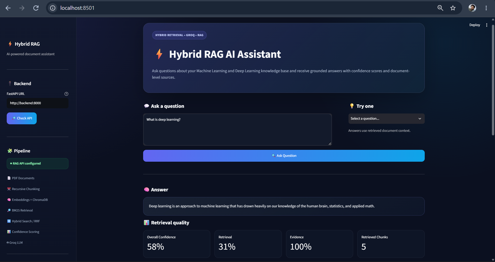
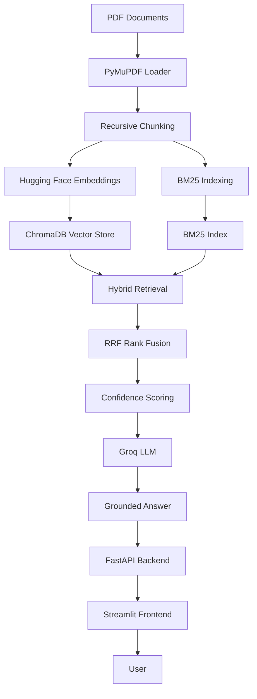
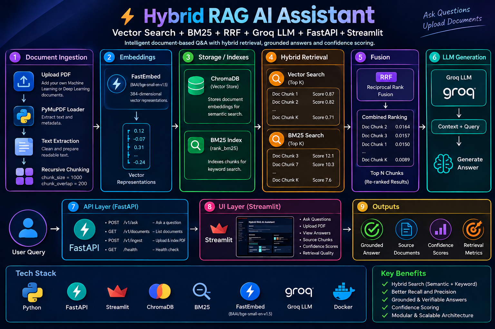
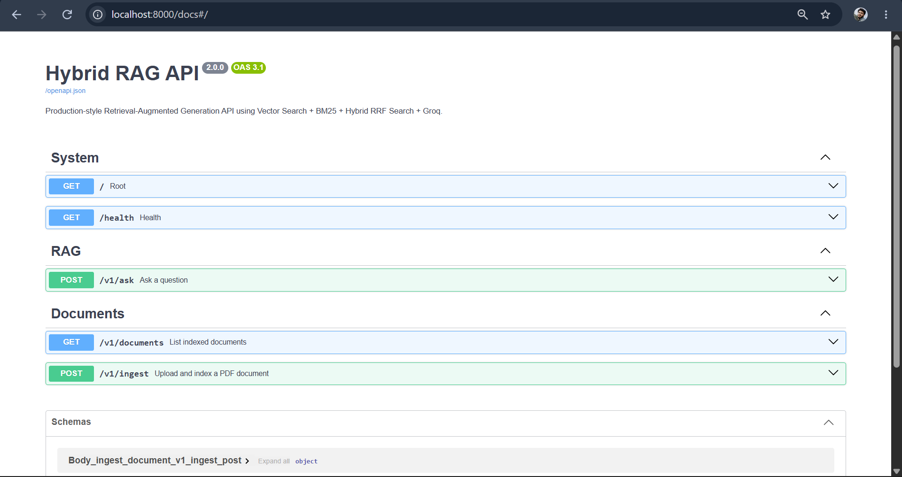

# ⚡ Hybrid RAG AI Assistant

<p align="center">
  <strong>Hybrid Retrieval • RAG • FastAPI • Streamlit • Groq • Docker</strong>
</p>

<p align="center">
An end-to-end Retrieval-Augmented Generation application combining semantic vector search,
BM25 keyword retrieval, Reciprocal Rank Fusion (RRF), confidence scoring, and Groq-powered
LLM generation for grounded document question answering.
</p>

<p align="center">


</p>

---

## 📌 Overview

**Hybrid RAG AI Assistant** is a document question-answering system designed to improve
retrieval quality by combining:

- Semantic vector search
- BM25 keyword retrieval
- Reciprocal Rank Fusion (RRF)
- Retrieval and evidence confidence scoring
- Groq LLM inference
- FastAPI REST services
- Streamlit interactive UI
- Docker Compose multi-service deployment

The core workflow is:

> **Retrieve relevant evidence first, then generate an answer grounded in that evidence.**

---

## ✨ Key Features

| Feature | Description |
|---|---|
| 📄 PDF Ingestion | Extract and index PDF documents |
| ✂️ Recursive Chunking | Creates overlapping document chunks |
| 🧠 Hugging Face Embeddings | Converts text into semantic vectors |
| 🔵 Vector Search | Semantic retrieval with ChromaDB |
| 🔤 BM25 Search | Exact-term and keyword retrieval |
| 🔀 Hybrid RRF Fusion | Combines vector and BM25 rankings |
| 📊 Confidence Scoring | Retrieval, evidence, and overall confidence |
| 🤖 Groq LLM | Fast grounded answer generation |
| 🛡️ Grounded Responses | Uses retrieved evidence for document answers |
| 🚀 FastAPI | REST API with Swagger documentation |
| 🖥️ Streamlit | Interactive question-answering dashboard |
| 🐳 Docker Compose | Reproducible frontend/backend deployment |
| 🔗 Docker Service Networking | Frontend reaches backend through `http://backend:8000` |
| ❤️ API Health Monitoring | Frontend can check backend availability |
| 💾 ChromaDB Persistence | Local vector-store data |

---

## 🖥️ Application

### Streamlit Frontend

The dashboard provides:

- Backend URL configuration
- API health monitoring
- Configurable retrieved chunks
- Suggested questions
- Generated answers
- Retrieval quality metrics
- Confidence scores
- Source attribution



---

## 🏗️ Architecture



### Retrieval Flow

```text
User Question
      ↓
FastAPI /v1/ask
      ↓
Hybrid Search
   ↙       ↘
Vector     BM25
Search     Search
   ↘       ↙
  RRF Rank Fusion
       ↓
Confidence Scoring
       ↓
    Groq LLM
       ↓
Answer + Sources + Confidence
```



---

## 🔀 Why Hybrid Search?

| Method | Strength | Limitation |
|---|---|---|
| Vector Search | Semantic similarity | Can miss exact technical terminology |
| BM25 | Exact keyword matching | Less effective with paraphrasing |
| Hybrid Search | Combines both signals | Requires fusion logic |

RRF combines rankings from both retrieval strategies to produce a more robust final ranking.

```text
Vector Ranking ──┐
                 ├──> RRF Fusion ──> Final Ranking
BM25 Ranking ────┘
```

---

## 📊 Confidence Scoring

Example response:

```json
{
  "question": "What does hybrid search combine?",
  "answer": "Hybrid search combines semantic vector retrieval with keyword-based retrieval such as BM25.",
  "confidence": {
    "retrieval_confidence": 0.85,
    "evidence_confidence": 0.95,
    "overall_confidence": 0.89
  },
  "retrieved_chunks": 5,
  "sources": ["Machine_Learning.pdf"]
}
```

| Metric | Meaning |
|---|---|
| Retrieval Confidence | Strength of document retrieval |
| Evidence Confidence | Strength of evidence supporting the answer |
| Overall Confidence | Combined application-level confidence |

> These are application-level confidence indicators, not guaranteed factual probabilities.

---

## 📁 Project Structure

```text
rag-hybrid-search/
│
├── data/
│   ├── raw/                    # Local PDF documents
│   └── chroma_db/              # Local ChromaDB data
│
├── frontend/
│   ├── ui.py                   # Streamlit application
│   └── requirements.txt        # Frontend dependencies
│
├── src/
│   ├── __init__.py
│   ├── api.py                  # FastAPI application
│   ├── loader.py               # PDF loading
│   ├── splitter.py             # Recursive chunking
│   ├── embedded.py             # Embeddings
│   ├── vectorstore.py          # ChromaDB
│   ├── bm25_retriever.py       # BM25 retrieval
│   ├── hybrid_search.py        # Hybrid/RRF retrieval
│   ├── confidence.py           # Confidence scoring
│   ├── rag_pipeline.py         # RAG orchestration
│   └── groq_con.py             # Groq integration
│
├── images/
│   ├── streamlit-ui.png
│   ├── architecture.png
│   └── swagger-api.png
│
├── .env                        # Local secrets - NOT committed
├── .gitignore
├── Dockerfile
├── docker-compose.yml
├── requirements.txt
├── README.md
└── LICENSE
```

---

## 🛠️ Technology Stack

### Backend

- Python 3.11
- FastAPI
- Uvicorn
- LangChain
- PyMuPDF
- Sentence Transformers / Hugging Face
- ChromaDB
- rank-bm25
- Groq API

### Frontend

- Streamlit
- Requests

### Infrastructure

- Docker
- Docker Compose
- Conda / virtual environments

---

## 🚀 Quick Start with Docker

### Prerequisites

- Docker Desktop
- Git
- Groq API key

### 1. Clone

```bash
git clone https://github.com/Vishnutpillai/rag-hybrid-search.git
cd rag-hybrid-search
```

### 2. Create `.env`

```env
GROQ_API_KEY=your_groq_api_key_here
```

Never commit `.env`.

### 3. Build and start

```bash
docker compose up -d --build
```

### 4. Verify

```bash
docker compose ps
```

Expected:

```text
hybrid-rag-backend     Up
hybrid-rag-frontend    Up
```

### 5. View logs

```bash
docker compose logs backend --tail=50
docker compose logs frontend --tail=50
```

### 6. Open the application

| Service | URL | Purpose |
|---|---|---|
| Streamlit | `http://localhost:8501` | Main UI |
| Swagger | `http://localhost:8000/docs` | API documentation |
| Health | `http://localhost:8000/health` | Backend health |
| API Root | `http://localhost:8000/` | API information |

---

## 🔗 Docker Compose Networking

The frontend and backend run as separate services.

Inside the Docker network, the frontend uses:

```text
http://backend:8000
```

From the Windows host/browser, use:

```text
http://localhost:8000
```

### Important

Do **not** use `localhost:8000` as the backend URL from inside the frontend container.

In Docker, `localhost` means the current container.

```text
Browser
   │
   ▼
localhost:8501
   │
   ▼
Streamlit Container
   │
   │ Docker network
   ▼
backend:8000
   │
   ▼
FastAPI Container
```

The frontend configuration is:

```yaml
environment:
  RAG_API_URL: http://backend:8000
```

This is the recommended service-to-service configuration for the Docker Compose setup.

---

## 🔌 FastAPI Backend

The backend provides endpoints for:

- Health checks
- Document listing
- PDF ingestion
- RAG question answering



Open Swagger:

```text
http://localhost:8000/docs
```

---

## 📡 API Endpoints

### `GET /`

Returns API information.

### `GET /health`

Checks backend availability.

### `POST /v1/ask`

Ask a question against the indexed knowledge base.

```json
{
  "question": "What is deep learning?",
  "top_k": 5
}
```

### `GET /v1/documents`

Lists indexed documents.

### `POST /v1/ingest`

Uploads and indexes a PDF.

Request type:

```text
multipart/form-data
```

Field:

```text
file
```

---

## 📄 Document Processing Pipeline

```text
PDF
 ↓
PyMuPDF
 ↓
Text Extraction
 ↓
Recursive Chunking
 ↓
 ┌────────────────┐
 │                │
 ▼                ▼
Embeddings       BM25
 │                │
 ▼                ▼
ChromaDB        BM25 Index
 │                │
 └───────┬────────┘
         ▼
   Hybrid Search
         ▼
     RRF Fusion
         ▼
 Confidence Scoring
         ▼
      Groq LLM
         ▼
   Grounded Answer
```

---

## 💡 Example Questions

```text
What is machine learning?

What is deep learning?

Explain the difference between supervised and unsupervised learning.

What does hybrid search combine?

How do neural networks work?

What is the role of embeddings in RAG?

Compare BM25 and vector search.

What is overfitting?
```

---

## 🖥️ Run Without Docker

### Backend

```bash
conda activate rag
pip install -r requirements.txt
uvicorn src.api:app --reload
```

Backend:

```text
http://localhost:8000
```

### Frontend

Open another terminal:

```bash
conda activate rag
pip install -r frontend/requirements.txt
streamlit run frontend/ui.py
```

Frontend:

```text
http://localhost:8501
```

For local non-Docker execution, the frontend backend URL should point to:

```text
http://localhost:8000
```

---

## 🔐 Environment Variables

| Variable | Required | Description |
|---|---|---|
| `GROQ_API_KEY` | Yes | Groq LLM API key |
| `RAG_API_URL` | Docker frontend | FastAPI backend URL |

Example:

```env
GROQ_API_KEY=gsk_xxxxxxxxxxxxxxxxx
```

Docker:

```yaml
environment:
  RAG_API_URL: http://backend:8000
```

### Security

Never expose API keys in:

- GitHub
- README files
- Screenshots
- Source code
- Docker images
- Public logs
- Commit history

---

## 🐳 Docker Commands

```bash
# Start
docker compose up -d

# Build and start
docker compose up -d --build

# Check containers
docker compose ps

# All logs
docker compose logs -f

# Backend logs
docker compose logs -f backend

# Frontend logs
docker compose logs -f frontend

# Stop
docker compose down

# Restart
docker compose restart

# Rebuild without cache
docker compose build --no-cache
```

---

## 🧪 Troubleshooting

### `API is not reachable`

Run:

```bash
docker compose ps
```

Both services should be `Up`.

Then:

```bash
docker compose logs backend --tail=100
```

Test:

```text
http://localhost:8000/health
```

For the Docker frontend, make sure:

```text
RAG_API_URL=http://backend:8000
```

not:

```text
RAG_API_URL=http://localhost:8000
```

### Containers are not running

```bash
docker compose up -d --build
docker compose ps
```

### Backend/RAG initialization fails

Check:

```bash
docker compose logs backend --tail=100
```

Verify:

- Required dependencies are installed
- PDF data is available to the application
- ChromaDB data is accessible when expected
- `GROQ_API_KEY` is configured
- The RAG pipeline initializes successfully

---

## 📦 Git Hygiene

Recommended `.gitignore`:

```gitignore
.env
*.pdf
data/raw/
data/chroma_db/
__pycache__/
*.pyc
*.pyo
*.egg-info/
.DS_Store
.vscode/
.idea/
```

Never commit API keys, private documents, local vector databases, or temporary files.

---

## 🗺️ Roadmap

### Near Term

- [ ] Authentication and authorization
- [ ] PostgreSQL metadata storage
- [ ] Redis caching
- [ ] Background document processing
- [ ] Improved error handling
- [ ] Automated API tests

### Medium Term

- [ ] Streaming LLM responses
- [ ] Cross-encoder re-ranking
- [ ] RAGAS evaluation
- [ ] Document deletion and re-indexing
- [ ] Page-level source citations

### Long Term

- [ ] Multi-user document collections
- [ ] Prometheus/Grafana monitoring
- [ ] CI/CD pipeline
- [ ] Cloud deployment
- [ ] Scalable vector database
- [ ] Advanced observability

---

## 🎯 What This Project Demonstrates

### AI / Machine Learning

```text
Python
 ├── NLP
 ├── Information Retrieval
 ├── Embeddings
 ├── Vector Search
 ├── BM25
 ├── Hybrid Search
 ├── RRF Rank Fusion
 ├── RAG Architecture
 └── LLM Integration
```

### Backend Engineering

```text
FastAPI
 ├── REST API
 ├── Health Checks
 ├── Document Ingestion
 ├── RAG Query Endpoint
 └── Swagger Documentation
```

### Production Engineering

```text
Docker
 ├── Containerization
 ├── Docker Compose
 ├── Multi-Service Architecture
 ├── Service-to-Service Networking
 ├── Environment Variables
 └── Restart Policies
```

### Frontend

```text
Streamlit
 ├── Interactive UI
 ├── API Health Monitoring
 ├── Question Input
 ├── Answer Display
 ├── Confidence Metrics
 └── Source Attribution
```

---

## 👨‍💻 Author

### Vishnu T Pillai

**Aspiring Data Scientist & AI Engineer**

Focused on Machine Learning, Deep Learning, NLP, RAG Systems, Generative AI, Data Science, and production-oriented AI applications.

- LinkedIn: https://www.linkedin.com/in/vishnu-t-pillai
- GitHub: https://github.com/Vishnutpillai

---

## 🤝 Contributing

1. Fork the repository
2. Create a feature branch

```bash
git checkout -b feature/amazing-feature
```

3. Commit your changes

```bash
git commit -m "Add amazing feature"
```

4. Push the branch

```bash
git push origin feature/amazing-feature
```

5. Open a Pull Request

---

## 📄 License

This project is licensed under the **MIT License**.

See [`LICENSE`](LICENSE) for details.

---

<div align="center">

### ⚡ Built with Python, FastAPI, Streamlit, ChromaDB, BM25, Docker & Groq

**Hybrid Retrieval • Grounded Generation • Production-Oriented RAG**

</div>
